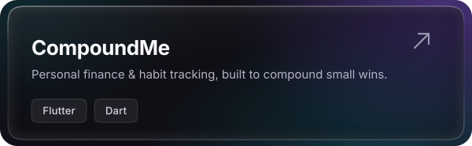
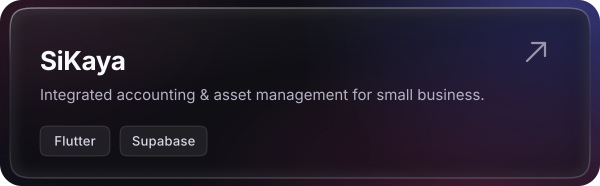
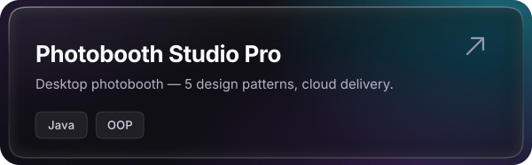
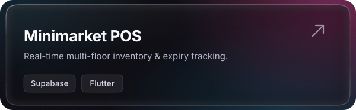
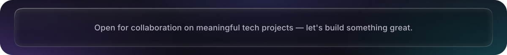

<!--
  Profile README — "Liquid Glass" theme.
  Every graphic in this file lives in ./assets and is generated by
  scripts/generate_assets.py. Edit that script and re-run it to change
  the copy, colours, tech stack or project cards:

      python3 scripts/generate_assets.py
-->

<picture>
  <source media="(prefers-color-scheme: dark)" srcset="assets/hero-dark.svg">
  <source media="(prefers-color-scheme: light)" srcset="assets/hero-light.svg">
  
</picture>

 

I build **mobile and desktop applications** for everyday problems — finance, accounting, inventory and point of sale. 
**Flutter · Dart** on the surface, **Supabase · PostgreSQL** underneath, with a soft spot for clean architecture.

<h3 align="center">Tech Stack</h3>

<picture>
  <source media="(prefers-color-scheme: dark)" srcset="assets/stack-dark.svg">
  <source media="(prefers-color-scheme: light)" srcset="assets/stack-light.svg">
  
</picture>

 

<h3 align="center">Featured Work</h3>

<a href="https://github.com/Umeem26/Compound_Me">
  <picture>
    <source media="(prefers-color-scheme: dark)" srcset="assets/project-compoundme-dark.svg">
    <source media="(prefers-color-scheme: light)" srcset="assets/project-compoundme-light.svg">
    
  </picture>
</a>
<a href="https://github.com/Umeem26/Apk-Mobile-Manajemen-Finance-Assets">
  <picture>
    <source media="(prefers-color-scheme: dark)" srcset="assets/project-sikaya-dark.svg">
    <source media="(prefers-color-scheme: light)" srcset="assets/project-sikaya-light.svg">
    
  </picture>
</a>
<a href="https://github.com/Umeem26/SixSeven-Photobooth-Studio">
  <picture>
    <source media="(prefers-color-scheme: dark)" srcset="assets/project-photobooth-dark.svg">
    <source media="(prefers-color-scheme: light)" srcset="assets/project-photobooth-light.svg">
    
  </picture>
</a>
<a href="https://github.com/Umeem26/Minimarket-Pos-System">
  <picture>
    <source media="(prefers-color-scheme: dark)" srcset="assets/project-minimarket-dark.svg">
    <source media="(prefers-color-scheme: light)" srcset="assets/project-minimarket-light.svg">
    
  </picture>
</a>

 

<h3 align="center">Activity</h3>

<picture>
  <source media="(prefers-color-scheme: dark)" srcset="https://github-readme-stats.vercel.app/api?username=Umeem26&show_icons=true&hide_border=true&rank_icon=github&bg_color=00000000&title_color=C4B5FD&icon_color=22D3EE&text_color=B6B3C6&ring_color=8B5CF6">
  <source media="(prefers-color-scheme: light)" srcset="https://github-readme-stats.vercel.app/api?username=Umeem26&show_icons=true&hide_border=true&rank_icon=github&bg_color=00000000&title_color=6D28D9&icon_color=0891B2&text_color=56526B&ring_color=8B5CF6">
  
</picture>
<picture>
  <source media="(prefers-color-scheme: dark)" srcset="https://github-readme-stats.vercel.app/api/top-langs/?username=Umeem26&layout=compact&langs_count=8&hide_border=true&bg_color=00000000&title_color=C4B5FD&text_color=B6B3C6">
  <source media="(prefers-color-scheme: light)" srcset="https://github-readme-stats.vercel.app/api/top-langs/?username=Umeem26&layout=compact&langs_count=8&hide_border=true&bg_color=00000000&title_color=6D28D9&text_color=56526B">
  
</picture>

 

<picture>
  <source media="(prefers-color-scheme: dark)" srcset="assets/footer-dark.svg">
  <source media="(prefers-color-scheme: light)" srcset="assets/footer-light.svg">
  
</picture>

  

