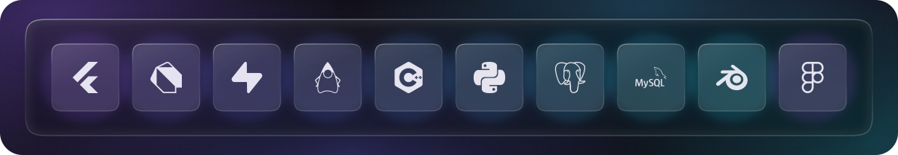

<!--
  Profile README.
  Every graphic lives in ./assets and is generated by scripts/generate_assets.py.
  Edit that script and re-run it — don't hand-edit the SVGs:

      python3 scripts/generate_assets.py
-->

<picture>
  <source media="(prefers-color-scheme: dark)" srcset="assets/hero-dark.svg">
  <source media="(prefers-color-scheme: light)" srcset="assets/hero-light.svg">
  
</picture>

 

<a href="https://linkedin.com/in/hisyam-khaeru-890a40350"><picture>
  <source media="(prefers-color-scheme: dark)" srcset="assets/pill-linkedin-dark.svg">
  <source media="(prefers-color-scheme: light)" srcset="assets/pill-linkedin-light.svg">
  
</picture></a>
<a href="https://instagram.com/hisyamkh.u"><picture>
  <source media="(prefers-color-scheme: dark)" srcset="assets/pill-instagram-dark.svg">
  <source media="(prefers-color-scheme: light)" srcset="assets/pill-instagram-light.svg">
  
</picture></a>
<a href="mailto:hisyamk.u5062@gmail.com"><picture>
  <source media="(prefers-color-scheme: dark)" srcset="assets/pill-email-dark.svg">
  <source media="(prefers-color-scheme: light)" srcset="assets/pill-email-light.svg">
  
</picture></a>

  

I build mobile and desktop applications for everyday problems, 
personal finance, accounting, inventory and point of sale.

 

<picture>
  <source media="(prefers-color-scheme: dark)" srcset="assets/stack-dark.svg">
  <source media="(prefers-color-scheme: light)" srcset="assets/stack-light.svg">
  
</picture>

